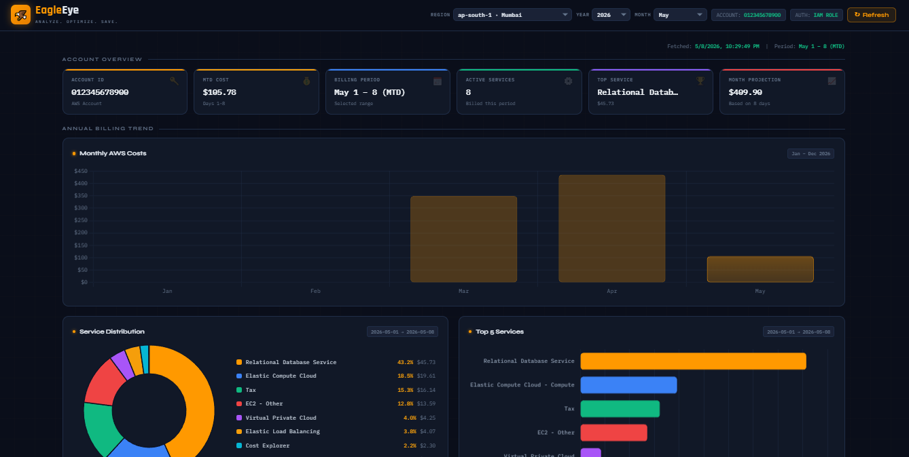
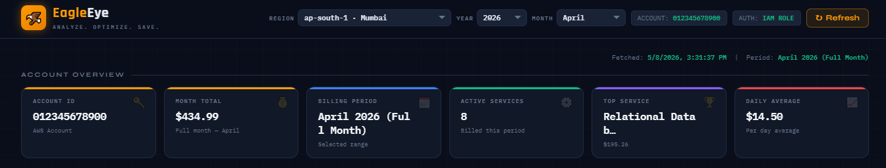
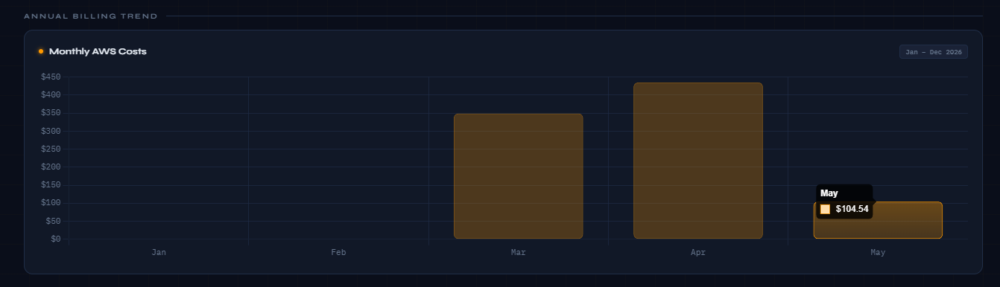
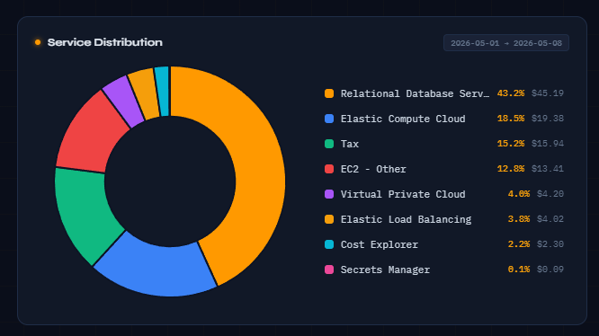
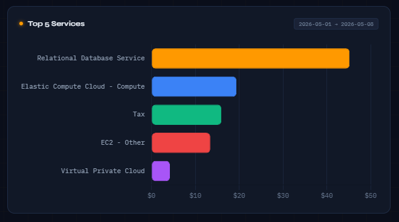
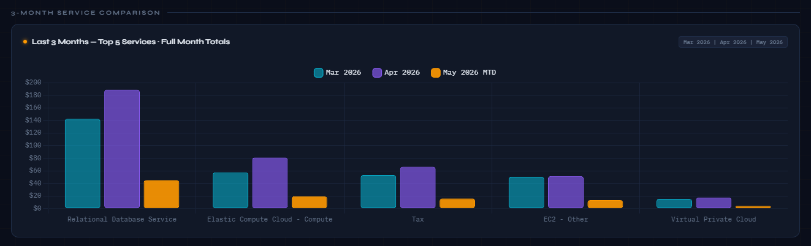
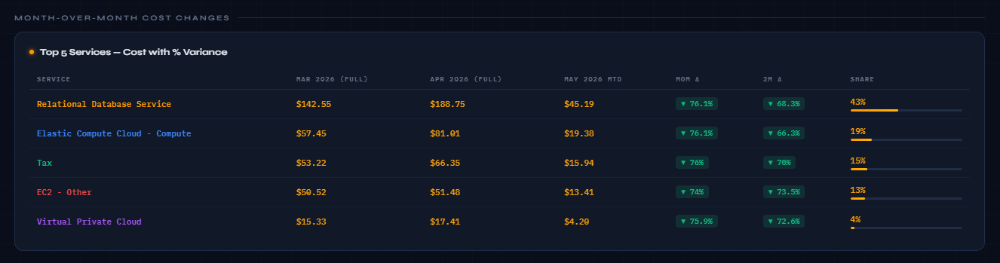
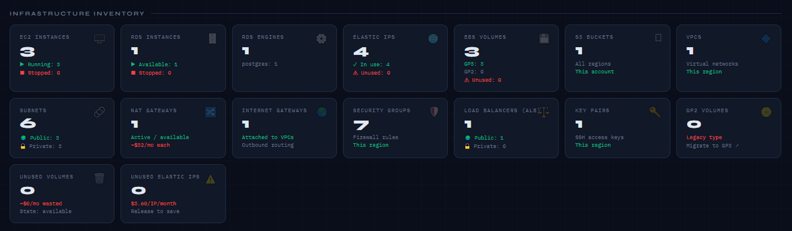
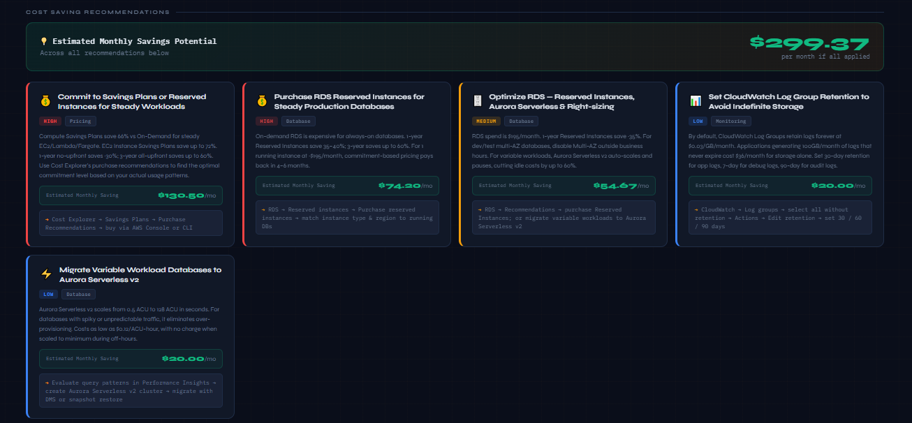

<div align="center">


# 🦅 EagleEye

### *Analyze. Optimize. Save.*

**A self-hosted, open-source AWS Billing Intelligence Dashboard built on Node.js.**  
Real-time cost visibility, infrastructure inventory, and AI-powered saving recommendations — all from your EC2 instance via IAM Role. No credentials stored. No third-party services.

<br/>

[](LICENSE)
[](https://nodejs.org)
[](https://github.com/aws/aws-sdk-js-v3)
[](https://www.chartjs.org)
[](https://docs.aws.amazon.com/IAM/latest/UserGuide/id_roles.html)
[](CONTRIBUTING.md)




<br/>

> **No API keys. No CSV uploads. No third-party SaaS.**  
> EagleEye runs on your EC2 instance and uses the attached IAM Role to pull live data directly from AWS APIs.

</div>

<br/>

---

## 📋 Table of Contents

- [✨ Features](#-features)
- [🏗️ Architecture](#️-architecture)
- [📊 Dashboard Panels Explained](#-dashboard-panels-explained)
- [🔐 IAM Setup — Step by Step](#-iam-setup--step-by-step)
- [🚀 Installation & Deployment](#-installation--deployment)
- [⚙️ Configuration](#️-configuration)
- [📁 Project Structure](#-project-structure)
- [🔌 API Reference](#-api-reference)
- [💡 Cost Saving Recommendations Engine](#-cost-saving-recommendations-engine)
- [🛡️ Security](#️-security)
- [🤝 Contributing](#-contributing)
- [📄 License](#-license)

---

## ✨ Features

| Feature | Details |
|---------|---------|
| 🔐 **Zero-credential auth** | Uses EC2 Instance Metadata (IMDSv2) — no keys ever stored |
| 📅 **Region / Year / Month selector** | All charts and inventory recalculate on any filter change |
| 📊 **6 interactive charts** | Annual bar, doughnut, horizontal bar, 3-month grouped compare |
| 💰 **Real-time cost data** | AWS Cost Explorer API — actual UnblendedCost amounts |
| 🏗️ **17-card infrastructure inventory** | EC2, RDS, EBS, S3, VPC, Subnets, NAT, IGW, SGs, ALBs, Key Pairs |
| 🗄️ **RDS visibility** | Instance count, running/stopped, engine breakdown, GP2 storage flag |
| 💡 **22 smart recommendations** | Auto-generated from live data — High / Medium / Low priority |
| 🔄 **15-min cache + manual refresh** | Avoids AWS API rate limits; ↻ Refresh button busts cache |
| 🌍 **19 AWS regions** | Full region list in dropdown; infra inventory switches per region |
| 🎨 **Dark-theme UI** | IBM Plex Mono + Syne fonts, grid texture, AWS orange accent system |
| 🖱️ **Interactive pie legend** | Click any row to toggle slice visibility |

---

## 🏗️ Architecture

```
┌──────────────────────────────────────────────────────────────────────┐
│                         YOUR AWS ACCOUNT                             │
│                                                                      │
│  ┌───────────────────────────────────────────────────────────────┐   │
│  │                      EC2 Instance                             │   │
│  │                                                               │   │
│  │   ┌──────────────────────────────────────────────────────┐    │   │
│  │   │               EagleEye  (Node.js / Express)          │    │   │
│  │   │               Listening on  0.0.0.0:3001             │    │   │
│  │   │                                                      │    │   │
│  │   │   ┌─────────────┐   ┌──────────────────────────┐     │    │   │
│  │   │   │  15-min     │   │  Recommendations         │     │    │   │
│  │   │   │  Cache      │   │  Engine (22 checks)      │     │    │   │
│  │   │   │  per region │   │  runs on every fetch     │     │    │   │
│  │   │   └─────────────┘   └──────────────────────────┘     │    │   │
│  │   └────────────────────────┬─────────────────────────────┘    │   │
│  │                            │  AWS SDK v3  (Promise.all)       │   │
│  │   ┌────────────────────────▼─────────────────────────────┐    │   │
│  │   │        IAM Role attached to this EC2 instance        │    │   │
│  │   │     (credentials from Instance Metadata Service)     │    │   │
│  │   └───────┬───────┬────────┬────────┬────────┬───────────┘    │   │
│  └───────────│───────│────────│────────│────────│─────────────── ┘   │
│              │       │        │        │        │                    │
│    ┌─────────▼─┐ ┌───▼──┐ ┌──▼──┐ ┌──▼──┐ ┌───▼────┐                 │
│    │   Cost    │ │ EC2  │ │ RDS │ │  S3 │ │  ELB   │                 │
│    │ Explorer  │ │ APIs │ │ API │ │ API │ │  API   │                 │
│    │(us-east-1)│ │      │ │     │ │     │ │        │                 │
│    └───────────┘ └──────┘ └─────┘ └─────┘ └────────┘                 │
│                                                                      │
└──────────────────────────────────────────────────────────────────────┘

     Your Browser ──HTTP──▶ EC2 :3001 ──AWS SDK──▶ AWS APIs
     (laptop/office)          EagleEye              (IAM Role)
```

### Request Flow

```
Browser: GET /api/billing?region=ap-south-1&year=2026&month=3
                │
                ▼
        Cache hit? ──YES──▶ return cached JSON (< 15 min old)
                │
               NO
                │
                ▼
        fetchAllData()  ─── Promise.all() runs 12 calls in parallel ───▶
        ┌──────────┬──────────┬──────────┬──────────┬──────────┬──────┐
        │STS:      │CE: cur   │CE: prev  │CE: 2-mo  │CE: year  │EC2:  │
        │GetCaller │month svc │month svc │ago svc   │monthly   │inst  │
        │Identity  │breakdown │breakdown │breakdown │totals    │      │
        └──────────┴──────────┴──────────┴──────────┴──────────┴──────┘
        ┌──────────┬──────────┬──────────┬──────────┬──────────┬──────┐
        │EC2:      │EC2:      │EC2:VPC/  │ELB:      │RDS:      │S3:   │
        │Elastic   │Volumes   │Subnet/   │Load      │DB        │List  │
        │IPs       │          │NAT/IGW/  │Balancers │Instances │Bucket│
        │          │          │SG/Keys   │          │          │s     │
        └──────────┴──────────┴──────────┴──────────┴──────────┴──────┘
                │
                ▼
        buildRecommendations()  → 22 checks → sorted HIGH→MEDIUM→LOW
                │
                ▼
        Store in cache  →  JSON response  →  Chart.js renders 6 charts
```

---

## 📊 Dashboard Panels Explained

### Account Overview (6 metric cards)

| Card | Data | Source |
|------|------|--------|
| Account ID | 12-digit AWS account number | `sts:GetCallerIdentity` |
| Month Total / MTD Cost | Total spend for selected period | `ce:GetCostAndUsage` |
| Billing Period | Human-readable date range | Derived from month/year selectors |
| Active Services | Count of services with non-zero cost | `ce:GetCostAndUsage` grouped by SERVICE |
| Top Service | Highest-cost service + amount | Same as above |
| Month Projection / Daily Avg | If current month: projects full-month spend | MTD ÷ days elapsed × days in month |

> For **past months**, the card shows the full month total and daily average.
> For the **current month**, it shows MTD cost and a projected end-of-month figure.




---

### 1. 📈 Monthly AWS Costs — Annual Trend Bar Chart

**What it shows:** Total AWS spend for every month of the selected year, Jan → Dec.



- **Highlighted bar** = the month chosen in the dropdown
- **Hover** any bar to see the exact dollar amount
- Selected month highlighted **solid orange**
- Future months in the current year show `$0`

**API:** `ce:GetCostAndUsage` — granularity MONTHLY, metric UnblendedCost

---

### 2. 🍩 Service Distribution — Doughnut Chart

**What it shows:** Each AWS service as a % of the selected month's total bill.



- Top 10 services get individual slices; everything else is grouped into **"Other Services"**
- **Custom HTML legend** on the right — full service name (stripped of "Amazon"/"AWS" prefix), % share, exact dollar cost
- **Click any legend row** to toggle that slice hidden/visible
- **Hover** a slice to see the tooltip with full name + cost + percentage

**API:** `ce:GetCostAndUsage` grouped by `SERVICE` dimension

---

### 3. 📊 Top 5 Services — Horizontal Bar Chart

**What it shows:** Your 5 most expensive services ranked, for the selected period.



- Each bar is a distinct color (matching the pie chart)
- X-axis = dollar amount; sorted longest → shortest (most → least expensive)
- Hover for exact value

**API:** Same data as doughnut chart, sliced to top 5

---

### 4. 📉 Last 3 Months — Grouped Bar Chart

**What it shows:** Side-by-side cost comparison of top 5 services across 3 consecutive months.



- **Cyan** = 2 months ago (always full calendar month)
- **Violet** = last month (always full calendar month)
- **Orange** = selected/current month (MTD if current month, full month if past)

**API:** 3 separate `ce:GetCostAndUsage` calls with different `TimePeriod` ranges

---

### 5. 📋 Month-over-Month Cost Changes Table

**What it shows:** Detailed cost breakdown of top 5 services with % change calculations.



| Column | Description |
|--------|-------------|
| Service | AWS service name |
| 2 Months Ago | Full month total |
| Last Month | Full month total |
| Current (MTD) | Selected month spend |
| MoM Δ | % change: last month → current |
| 2M Δ | % change: 2 months ago → current |
| Share | % of total bill with visual bar |

- 🔴 `▲ +x%` = cost increased
- 🟢 `▼ -x%` = cost decreased
- `— N/A` = no billing data for that service in that month

---

### 6. 🏗️ Infrastructure Inventory (17 Cards)

Live resource counts for the selected region, fetched in parallel:



| Card | API Action | What it shows |
|------|-----------|---------------|
| EC2 Instances | `ec2:DescribeInstances` | Total, running, stopped |
| RDS Instances | `rds:DescribeDBInstances` | Total, available, stopped |
| RDS Engines | `rds:DescribeDBInstances` | Engine types + instance count per engine |
| Elastic IPs | `ec2:DescribeAddresses` | Total, in-use, unused (cost warning) |
| EBS Volumes | `ec2:DescribeVolumes` | Total, GP3, GP2, unused |
| S3 Buckets | `s3:ListAllMyBuckets` | All buckets in the account |
| VPCs | `ec2:DescribeVpcs` | Count in region |
| Subnets | `ec2:DescribeSubnets` | Total, public, private |
| NAT Gateways | `ec2:DescribeNatGateways` | Active count + cost note |
| Internet Gateways | `ec2:DescribeInternetGateways` | Count in region |
| Security Groups | `ec2:DescribeSecurityGroups` | Count in region |
| Load Balancers (ALB) | `elasticloadbalancing:DescribeLoadBalancers` | Total, public, private |
| Key Pairs | `ec2:DescribeKeyPairs` | Count in region |
| GP2 Volumes | `ec2:DescribeVolumes` | Legacy type (recommend GP3) |
| Unused Volumes | `ec2:DescribeVolumes` | State = available, estimated wasted cost |
| Unused Elastic IPs | `ec2:DescribeAddresses` | Count + $3.60/mo cost per IP |
| Stopped RDS Cost | `rds:DescribeDBInstances` | Shown only when stopped DBs exist |

---

### 7. 💡 Cost Saving Recommendations



See [Recommendations Engine](#-cost-saving-recommendations-engine) for full details.

---

## 🔐 IAM Setup — Step by Step

EagleEye only calls **read-only** AWS APIs. It never creates, modifies, or deletes resources.

### Step 1 — Create the IAM Policy

**Via AWS CLI:**
```bash
aws iam create-policy \
  --policy-name EagleEyeDashboardPolicy \
  --policy-document file://eagleeye-iam-policy.json \
  --description "Read-only policy for EagleEye billing dashboard"
```

**Via AWS Console:**
1. Open **IAM → Policies → Create policy**
2. Click the **JSON** tab
3. Paste the contents of `eagleeye-iam-policy.json`
4. Name it `EagleEyeDashboardPolicy` → Create

The policy grants these read-only permissions:

| AWS Service | Actions | Purpose |
|-------------|---------|---------|
| Cost Explorer | `GetCostAndUsage`, `GetCostForecast`, `GetDimensionValues` | Monthly billing, service breakdown, 3-month history |
| EC2 | 12× `Describe*` actions | Instances, EIPs, volumes, VPCs, subnets, NAT GWs, SGs, key pairs |
| RDS | `DescribeDBInstances`, `DescribeDBClusters`, `ListTagsForResource` | Database inventory and engine info |
| S3 | `ListAllMyBuckets`, `GetBucketLocation` | Bucket count across account |
| ELB v2 | `DescribeLoadBalancers`, `DescribeTargetGroups`, `DescribeListeners` | ALB count, public vs private |
| STS | `GetCallerIdentity` | Fetch account ID |

> ✅ All actions are `Describe*`, `List*`, or `Get*` — strictly read-only.

---

### Step 2 — Create the IAM Role

```bash
# Create the trust policy file
cat > /tmp/eagleeye-trust.json << 'EOF'
{
  "Version": "2012-10-17",
  "Statement": [
    {
      "Effect": "Allow",
      "Principal": { "Service": "ec2.amazonaws.com" },
      "Action": "sts:AssumeRole"
    }
  ]
}
EOF

# Create the role
aws iam create-role \
  --role-name EagleEyeDashboardRole \
  --assume-role-policy-document file:///tmp/eagleeye-trust.json \
  --description "IAM Role for EagleEye dashboard on EC2"

# Attach the policy (replace ACCOUNT_ID with your 12-digit account ID)
aws iam attach-role-policy \
  --role-name EagleEyeDashboardRole \
  --policy-arn arn:aws:iam::ACCOUNT_ID:policy/EagleEyeDashboardPolicy
```

---

### Step 3 — Attach Role to EC2 Instance

**Existing instance (Console):**
1. EC2 → Instances → select your instance
2. Actions → Security → **Modify IAM Role**
3. Select `EagleEyeDashboardRole` → **Update IAM Role**

**Existing instance (CLI):**
```bash
# First create an instance profile if it doesn't exist
aws iam create-instance-profile \
  --instance-profile-name EagleEyeDashboardProfile

aws iam add-role-to-instance-profile \
  --instance-profile-name EagleEyeDashboardProfile \
  --role-name EagleEyeDashboardRole

# Attach to running instance
aws ec2 associate-iam-instance-profile \
  --instance-id i-0xxxxxxxxxxxxxxxxx \
  --iam-instance-profile Name=EagleEyeDashboardProfile
```

**New instance (CLI):**
```bash
aws ec2 run-instances \
  --image-id ami-0xxxxxxxxxxxxxxxxx \
  --instance-type t3.small \
  --iam-instance-profile Name=EagleEyeDashboardProfile \
  --key-name your-key-pair \
  --security-group-ids sg-xxxxxxxxxxxxxxxxx \
  --subnet-id subnet-xxxxxxxxxxxxxxxxx
```

---

### Step 4 — Enable AWS Cost Explorer (one-time)

> ⚠️ Cost Explorer must be enabled in your account or billing data will be empty.

```
AWS Console → Billing → Cost Explorer → Enable Cost Explorer
```

Takes up to 24 hours for data to populate on first enable.

---

## 🚀 Installation & Deployment

### Prerequisites

| Requirement | Minimum Version | How to check |
|-------------|----------------|--------------|
| Node.js | 18 LTS | `node --version` |
| npm | 8 | `npm --version` |
| EC2 instance | Any size (t3.micro works) | with IAM role attached |
| OS | Ubuntu 20.04+ or Amazon Linux 2+ | — |

---

### Step 1 — Install Node.js on EC2

**Ubuntu / Debian:**
```bash
# Install Node.js 20 LTS
curl -fsSL https://deb.nodesource.com/setup_20.x | sudo -E bash -
sudo apt-get install -y nodejs

# Verify
node --version   # should print v20.x.x
npm --version    # should print 10.x.x
```

**Amazon Linux 2023:**
```bash
# Install via nvm
curl -o- https://raw.githubusercontent.com/nvm-sh/nvm/v0.39.7/install.sh | bash
source ~/.bashrc
nvm install 20
nvm use 20

node --version
npm --version
```

**Amazon Linux 2:**
```bash
curl -fsSL https://rpm.nodesource.com/setup_20.x | sudo bash -
sudo yum install -y nodejs
node --version
```

---

### Step 2 — Clone and Install

```bash
# Clone the repo
git clone https://github.com/krishnabagal/eagleeye.git
cd eagleeye

# Install all dependencies
npm install
```

This installs:

| Package | Purpose |
|---------|---------|
| `express` | HTTP server and static file serving |
| `@aws-sdk/client-cost-explorer` | Billing data from Cost Explorer |
| `@aws-sdk/client-ec2` | EC2, VPC, volumes, subnets, security groups |
| `@aws-sdk/client-rds` | RDS database inventory |
| `@aws-sdk/client-s3` | S3 bucket listing |
| `@aws-sdk/client-sts` | Account identity |
| `@aws-sdk/client-elastic-load-balancing-v2` | ALB inventory |
| `multer` | Multipart middleware |

---

### Step 3 — Start EagleEye

```bash
node server.js
```

Expected output:
```
✅  EagleEye — AWS Billing Intelligence → http://0.0.0.0:3001
    Auth: IAM Role (EC2 Instance Metadata)
```

Open in browser: **`http://YOUR_EC2_PUBLIC_IP:3001`**

---

### Step 4 — Open Port 3001 in Security Group

```bash
# Allow your IP only (recommended)
aws ec2 authorize-security-group-ingress \
  --group-id sg-xxxxxxxxxxxxxxxxx \
  --protocol tcp \
  --port 3001 \
  --cidr YOUR_IP_ADDRESS/32

# Or allow your office subnet
aws ec2 authorize-security-group-ingress \
  --group-id sg-xxxxxxxxxxxxxxxxx \
  --protocol tcp \
  --port 3001 \
  --cidr 203.0.113.0/24
```

> 🔒 Do **not** open port 3001 to `0.0.0.0/0`. Restrict to your IP or put an HTTPS ALB in front.

---

### Step 5 — Run as a Persistent Service

**Using PM2 (recommended):**
```bash
# Install PM2 globally
npm install -g pm2

# Start EagleEye
pm2 start server.js --name eagleeye

# Persist across reboots
pm2 startup
pm2 save

# Useful commands
pm2 status
pm2 logs eagleeye
pm2 restart eagleeye
```

**Using systemd:**
```bash
sudo tee /etc/systemd/system/eagleeye.service << 'EOF'
[Unit]
Description=EagleEye AWS Billing Dashboard
After=network.target

[Service]
Type=simple
User=ubuntu
WorkingDirectory=/home/ubuntu/eagleeye
ExecStart=/usr/bin/node server.js
Restart=on-failure
RestartSec=10
Environment=PORT=3001
Environment=AWS_REGION=us-east-1

[Install]
WantedBy=multi-user.target
EOF

sudo systemctl daemon-reload
sudo systemctl enable eagleeye
sudo systemctl start eagleeye
sudo systemctl status eagleeye
```

---

## ⚙️ Configuration

### Environment Variables

| Variable | Default | Description |
|----------|---------|-------------|
| `PORT` | `3001` | TCP port to bind (always on `0.0.0.0`) |
| `AWS_REGION` | `us-east-1` | Default region on dashboard load |

```bash
PORT=8080 AWS_REGION=ap-south-1 node server.js
```

### Cache TTL

Results are cached for 15 minutes per `region_year_month` key. To change:

```js
// server.js
const TTL = 15 * 60 * 1000;   // change to e.g. 5 * 60 * 1000 for 5 minutes
```

---

## 📁 Project Structure

```
eagleeye/
├── server.js                   # Express server + all AWS SDK calls
├── package.json                # Dependencies manifest
├── eagleeye-iam-policy.json    # IAM policy (copy-paste ready for AWS Console)
├── LICENSE                     # MIT License
├── CONTRIBUTING.md             # Contribution guide
├── README.md                   # This file
│
└── public/
    └── index.html              # Complete single-page dashboard
                                # (all JS, CSS, and Chart.js logic inline)
```

### `server.js` Internal Structure

```
Imports  →  AWS SDK clients (6 services)
            Express setup

Helpers  →  getClients(region)      per-region client cache
            monthRange(year, month) date math for CE API
            yearRange(year)         full-year date range

Fetchers →  ceCostByService()       service breakdown for any date range
            ceMonthlyTotals()       12-month bar chart data
            fetchEC2Stats()         instances running/stopped
            fetchElasticIPs()       EIP in-use vs unused
            fetchVolumes()          EBS GP2/GP3/unused breakdown
            fetchVPCStats()         VPC, subnet, NAT, IGW, SG, key pairs
            fetchALBStats()         ALB public/private count
            fetchRDSStats()         DB instances, engines, stopped, GP2
            fetchS3Count()          bucket count

Engine   →  buildRecommendations()  22 checks → saving recommendations

Core     →  fetchAllData()          Promise.all orchestrator
            getCached()             15-min TTL cache layer

Routes   →  GET /api/billing        main data endpoint
            GET /api/refresh        cache-bust + re-fetch
```

---

## 🔌 API Reference

### `GET /api/billing`

Returns billing + infrastructure data. Cached per `region_year_month` for 15 minutes.

**Query parameters:**

| Param | Type | Default | Description |
|-------|------|---------|-------------|
| `region` | string | `us-east-1` | AWS region code |
| `year` | integer | current year | e.g. `2026` |
| `month` | integer | current month | 0-based (0 = January, 11 = December) |

```bash
# April 2026, Mumbai region
curl "http://localhost:3001/api/billing?region=ap-south-1&year=2026&month=3"
```

**Response shape:**
```jsonc
{
  "accountId": "249127818942",
  "billingPeriod": "April 2026 (Full Month)",
  "region": "ap-south-1",
  "billingYear": 2026,
  "billingMonth": 3,
  "isCurrentMonth": false,
  "currentMonthTotal": 434.99,
  "dateRange": { "start": "2026-04-01", "end": "2026-04-30" },
  "services": [
    { "name": "Relational Database Service", "cost": 195.26 },
    { "name": "Elastic Compute Cloud - Compute", "cost": 84.03 }
    // ...
  ],
  "lastMonthServices": [ /* same shape, March 2026 */ ],
  "twoMonthsAgoServices": [ /* same shape, February 2026 */ ],
  "monthlyData": [
    { "month": "Jan", "amount": 389.12 },
    { "month": "Feb", "amount": 401.55 }
    // ... through Dec
  ],
  "infraStats": {
    "ec2": { "total": 5, "running": 3, "stopped": 2 },
    "rds": {
      "total": 3, "available": 2, "stopped": 1,
      "engines": { "mysql": 2, "postgres": 1 },
      "multiAZ": 1, "gp2Storage": 2
    },
    "elasticIPs": { "total": 4, "unused": 1 },
    "volumes": { "total": 12, "gp2": 3, "gp3": 8, "unused": 1, "gp2Gb": 300 },
    "s3Buckets": 8,
    "vpcs": 2,
    "subnets": { "total": 8, "public": 3, "private": 5 },
    "natGateways": 1,
    "internetGateways": 2,
    "securityGroups": 14,
    "keyPairs": 3,
    "alb": { "total": 2, "public": 1, "private": 1 }
  },
  "recommendations": [
    {
      "category": "Database",
      "priority": "HIGH",
      "icon": "🗄️",
      "title": "Terminate or Restart 1 Stopped RDS Instance",
      "description": "...",
      "monthlySaving": 15.00,
      "action": "RDS → Databases → filter stopped → ..."
    }
    // up to 22 recommendations
  ],
  "fetchedAt": "2026-05-08T12:00:00.000Z"
}
```

---

### `GET /api/refresh`

Force cache invalidation and re-fetch from AWS. Same query parameters as `/api/billing`.

```bash
curl "http://localhost:3001/api/refresh?region=ap-south-1&year=2026&month=3"
```

Returns same shape as `/api/billing` with a fresh `fetchedAt` timestamp.

---

## 💡 Cost Saving Recommendations Engine

EagleEye automatically generates up to **22 recommendations** by comparing live infrastructure data against cost optimization best practices. They are sorted: HIGH priority first, then MEDIUM, then LOW; within each group sorted by estimated monthly saving descending.

### All 22 Recommendations

| # | Priority | Category | Trigger Condition |
|---|----------|----------|------------------|
| 1 | 🔴 HIGH | Networking | Unused Elastic IPs > 0 |
| 2 | 🔴 HIGH | Storage | Unattached EBS volumes > 0 |
| 3 | 🔴 HIGH | Compute | EC2 spend > $200/month |
| 4 | 🔴 HIGH | Pricing | Total bill > $500/month |
| 5 | 🔴 HIGH | Database | Stopped RDS instances > 0 |
| 6 | 🔴 HIGH | Database | Running RDS instances > 0 and RDS spend > $80 |
| 7 | 🟡 MEDIUM | Storage | GP2 EBS volumes > 0 |
| 8 | 🟡 MEDIUM | Compute | Stopped EC2 instances > 0 |
| 9 | 🟡 MEDIUM | Networking | NAT Gateways > 1 |
| 10 | 🟡 MEDIUM | S3 Storage | S3 spend > $10/month |
| 11 | 🟡 MEDIUM | S3 Storage | S3 bucket count > 5 |
| 12 | 🟡 MEDIUM | S3 Storage | S3 spend > $30/month |
| 13 | 🟡 MEDIUM | Networking | Data transfer spend > $30/month |
| 14 | 🟡 MEDIUM | Database | RDS GP2 storage > 0 instances |
| 15 | 🟡 MEDIUM | Database | Multi-AZ RDS instances > 1 |
| 16 | 🟡 MEDIUM | Database | MySQL/Postgres instances present |
| 17 | 🔵 LOW | Compute | Spot Instances — always shown |
| 18 | 🔵 LOW | Compute | Lambda spend > $30/month |
| 19 | 🔵 LOW | S3 Storage | S3 multipart cleanup — always shown |
| 20 | 🔵 LOW | S3 Storage | S3 request optimization — S3 spend > $20 |
| 21 | 🔵 LOW | Database | Aurora Serverless — MySQL/Postgres present |
| 22 | 🔵 LOW | Monitoring | CloudWatch retention — always shown |

### Saving Estimates

All estimates are conservative, based on AWS public pricing (ap-south-1 / us-east-1 baseline) and typical reduction percentages from AWS Cost Optimization documentation. Actual savings may vary.

---

## 🛡️ Security

### What EagleEye never does

| ❌ | Detail |
|----|--------|
| Store credentials | Uses EC2 Instance Metadata Service (IMDSv2) only |
| Modify AWS resources | Every API call is read-only (`Describe*`, `List*`, `Get*`) |
| Send data externally | Runs entirely within your VPC |
| Write to disk | In-memory cache only; lost on process restart |
| Log financial data | No billing amounts written to any log file |

### Hardening checklist

```bash
# 1. Enforce IMDSv2 on your EC2 instance (prevents SSRF attacks against metadata)
aws ec2 modify-instance-metadata-options \
  --instance-id i-0xxxxxxxxxxxxxxxxx \
  --http-tokens required \
  --http-put-response-hop-limit 1

# 2. Restrict Security Group — allow port 3001 from your IP only
aws ec2 authorize-security-group-ingress \
  --group-id sg-xxxxxxxxxxxxxxxxx \
  --protocol tcp --port 3001 \
  --cidr YOUR_IP/32

# 3. Enable CloudTrail to audit all API calls by the role
aws cloudtrail create-trail \
  --name eagleeye-audit \
  --s3-bucket-name your-cloudtrail-bucket

# 4. For production — put HTTPS ALB in front of port 3001
#    Use AWS Certificate Manager (ACM) for a free TLS certificate
```

---

## 🤝 Contributing

```bash
git clone https://github.com/krishnabagal/eagleeye.git
cd eagleeye && npm install

git checkout -b feature/your-feature
# make changes
node server.js   # test locally

git add . && git commit -m "feat: describe your change"
git push origin feature/your-feature
# open Pull Request on GitHub
```

**Ideas for contributions:**
- [ ] AWS Budgets alerts integration
- [ ] Tag-based cost filtering (cost by team / project tag)
- [ ] Export dashboard to PDF
- [ ] Weekly cost digest email / Slack webhook
- [ ] Multi-account support via AWS Organizations
- [ ] Reserved Instance coverage chart
- [ ] Mobile-responsive layout
- [ ] Dark / light theme toggle

See [CONTRIBUTING.md](CONTRIBUTING.md) for full guidelines.

---

## 📄 License

MIT © 2026 EagleEye Contributors — see [LICENSE](LICENSE) for full text.

### Third-party open-source licenses

| Package | License |
|---------|---------|
| [Express.js](https://expressjs.com) | MIT |
| [AWS SDK for JavaScript v3](https://github.com/aws/aws-sdk-js-v3) | Apache-2.0 |
| [Chart.js](https://www.chartjs.org) | MIT |
| [Multer](https://github.com/expressjs/multer) | MIT |
| [IBM Plex Mono](https://fonts.google.com/specimen/IBM+Plex+Mono) | SIL OFL 1.1 |
| [Syne](https://fonts.google.com/specimen/Syne) | SIL OFL 1.1 |

---

<div align="center">

**Built with ❤️ for the AWS community**

⭐ Star this repo if EagleEye helped you cut your AWS bill!

[🐛 Report Bug](https://github.com/your-username/eagleeye/issues) · [💡 Request Feature](https://github.com/your-username/eagleeye/issues) · [💬 Discussions](https://github.com/your-username/eagleeye/discussions)

</div>
